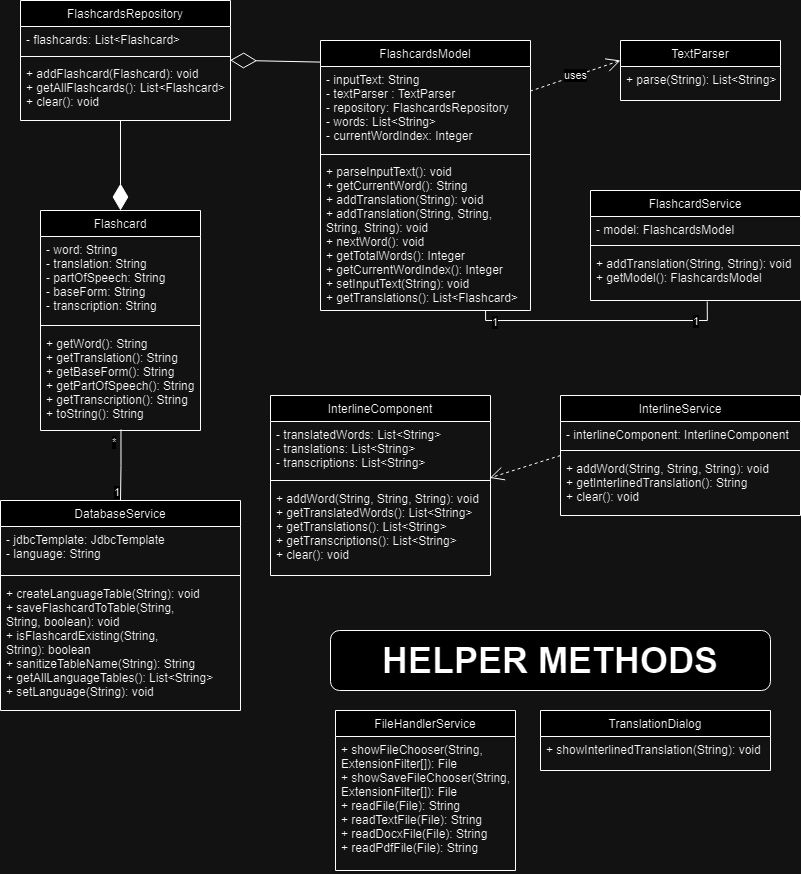

# Let's go fishing! - Interactive flashcards creator

## Introduction
The purpose of the application is to support the process of learning foreign languages ​​by automatically generating flashcards based on the provided text. The user can create vocabulary flashcards with translations and then export them to the CSV format, compatible with external language learning applications.

## Installation

<ol> 
    <li> Download and install JDK version 23 or higher (e.g. OpenJDK or Oracle JDK) </li>
    - Set the <i>JAVA_HOME</i> environment variable pointing to the downloaded JDK 23 or higher location
    <li> Clone the project repository from <i> bitbucket </i> </li>
    <b><i> - git clone https://bitbucket.lab.ii.agh.edu.pl/scm/to2024/kp-wt-1500-lets-go-fishing.git </i></b>
    <li> Open IntelliJ IDEA, choose: File → Open… , then select the <b>Let's go fishing!</b> folder </li>
    <li>IntelliJ will automatically recognize your Gradle project. If not: right-click on the <b> build.gradle file → Link Gradle Project </b> </li>
    <li> Make sure JDK 23 or higher is selected in your project settings: <b> File → Project Structure → SDK → select JDK 23 or higher</b> </li>
    <li> To start the application, click the ▶ (Run) button in the upper right corner </li>
    <li> If the application started correctly, a controller window should appear on the screen  </li>
    - In case of any problems, check the IntelliJ or Gradle logs (e.g. missing dependencies)
</ol>

## GUI description
<ul>
    <li> Left section: </li>
    <ul>
        <li> Select language choice box - user can select language in which he will provide the translation, or enter a new language, that is not yet in the database. </li>
        <li> Input text field - user can enter text from the keyboard or by pasting it inside the box. </li>
        <li> Import text from file - user can select ready file with the text to import it. </li>
        <li> Create flashcards button - initiate the process of generating flashcards from the input text. </li>
    </ul>
    <li> Right section: </li>
    <ul>
        <li> Before start: </li>
        <ul>
            <li> Current word label - it will show currently translated word after the start. </li>
            <li> The rest is blank. </li>
        </ul>
        <li> After start: </li>
        <ul>
            <li> Current word label - displaying the word currently translated. </li>
            <li> Translated word input field - text box where user inputs the translation for the current word. </li>
            <li> Part of speech choice box - choice box where user selects part of speech of the current word.  </li>
            <li> Basic form text field - text box where user inputs the basic form of the current word. </li>
            <li> Already basic check box - user can select if current word is already basic or not, if so, text box on the left becomes disabled. </li>
            <li> Transcription text field - text box, where user can provide the transcription of the current word. </li>
            <li> Submit word button - submits the entered translation and moves to the next word. </li>
            <li> Translation progress bar - progress bar that indicates how much of the translation has been completed. </li>
        </ul>
        <li> When finished: </li>
        <ul>
            <li> Interlined translation window - shows the completed translation in interline where top line is the text provided at the start, second line are translations for each of the word and third line is transcription of each word. User can also copy the result to the clipboard. </li>
            <ul>
                <li>Save to PDF/PNG button - allows user to save the interlined translation to PDF or PNG file on the computer</li>
                <li>OK button - closes the interline window</li>
            </ul>
            <li> Filled translation progress bar - shows completion of the translation (100%) and the total number of words. </li>
            <li> Current word label - shows "All done!" text, that indicates that task has been completed. </li>
            <li> Save to CSV button - exports your ready and translated flashcards to the universal CSV file. </li>
        </ul>
    </ul>
</ul>

## Data model class diagram [OUTDATED]

## Flow diagram
[Available here](https://miro.com/app/board/uXjVL5kTpR8=/?share_link_id=809900169708)

## Contributors

- Dawid Mularczyk
- Przemysław Popowski
- Maciej Wilewski
- Łukasz Zegar

Students at AGH University - Computer Science - Faculty of Computer Science \
Project at object-oriented technologies course - 5th semester - 2024/2025

## Changelog

<ul>
    <li> Milestone 3 - version 2 :</li>
    <ul>
        <li> 28.01.2025 - Added parallel and indent interline - Przemysław</li>
            <ul>
                <li> Created SentenceSplit class </li>
                <li> Added SentenceSplit unit tests </li>
                <li> Added division of the sentences into subordinate and coordinate </li>
                <li> Connected InterlineService with Sentence creating </li>
                <li> Updated InterlineService to create parallel and indent interline </li>
                <li> Updated InterlineService tests </li>
            </ul>
        <li> 28.01.2025 - Updated GUI description, flowchart and class diagram - Przemysław</li>
        <li> 28.01.2025 - Updated changelog - Maciej</li>
        <li> 28.01.2025 - Added tests - Łukasz</li>
            <ul>
                <li> Interline, InterlineComponent and InterlineService tests</li>
                <li> WordPart unit tests</li>
            </ul>
        <li> 28.01.2025 - Sonarqube fixes - Maciej</li>
        <li> 27.01.2025 - "For" loops reduction, InterlineService refactor - Przemysław</li>
            <ul>
                <li>Added streams</li>
                <li>Divided InterlineService into more methods</li>
                <li> Fixed InterlineService to properly end the sentences when ".", "!", "?" met</li>
                <li> Changed InterlineService to format lines and build the proper interlined translation </li>
            </ul>
        <li> 26.01.2025 - Comment fixes - Maciej</li>
            <ul>
                <li>Removed unnecessary lines</li>
                <li>Magic string into static final</li>
                <li>Added WordPart instead of Pair</li>
            </ul>
        <li> 26.01.2025 - Unnecessary comments removal - Dawid</li>
    </ul>
    <li> Milestone 3 - version 1 :</li>
    <ul>
        <li> 20.01.2025 - Part 1 of syntax analysis - Dawid</li>
        <li> 20.01.2025 - Added Tests for Sentence logic - Łukasz</li>
        <li> 19.01.2025 - Sonarqube quickfix - Maciej</li>
        <li> 19.01.2025 - Sentence division - Maciej</li>
            <ul>
                <li>Added many classes to operate Sentence logic</li>
                <li>Added SentenceParser to parse each sentence, count words in them and divide them by "."</li>
            </ul>
        <li> 19.01.2025 - Adjusted TEST VERSION to final version, removed hardcoded tests - Przemysław</li>
        <li> 17.01.2025 - Added Part of Sentence logic - Przemysław</li>
            <ul>
                <li>Adjusted gui for part of sentence input</li>
                <li>Added part of sentence verification based on part of speech</li>
            </ul>
        <li> 16.01.2025 - Added saving interline to PDF and PNG files - TEST VERSION - Przemysław</li>
    </ul>
    <li> Milestone 2 - version 2 :</li>
    <ul>
        <li> 14.01.2025 - Fixed SonarQube issues - Maciej</li>
        <li> 14.01.2025 - Updated README - Przemysław</li>
            <ul>
                <li>Fixed changelog view</li>
                <li>Updated flowchart</li>
                <li>Updated data model class diagram</li>
                <li>Updated GUI description</li>
            </ul>
        <li> 13.01.2025 - Updated changelog - Maciej</li>
        <li> 11.01.2025 - Reformatted Interline - Przemysław</li>
            <ul>
                <li>Added InterlineComponent and TranslationDialog</li>
                <li>Fixed SRP issues with InterlineService</li>
            </ul>
        <li> 09.01.2025 - Reformatted DatabaseService - Maciej</li>
        <li> 04.01.2025 - Fixed tests and removed "wild card" imports - Łukasz</li>
    </ul>
    <li> Milestone 2 - version 1 :</li>
    <ul>
        <li> 17.12.2024 - Fixed SonarQube - Łukasz</li>
        <li> 17.12.2024 - Adjusted frontend and error handling - Przemysław</li>
        <li> 17.12.2024 - Added database unit and integrity tests - Łukasz</li>
        <li> 17.12.2024 - Added database - Maciej</li>
            <ul>
                <li>Added H2 database</li>
                <li>Added DatabaseService</li>
                <li>Added choosing which language to save to</li>
                <li>Added saving to chosen language table</li>
            </ul>
        <li> 16.12.2024 - Updated backend to match the new frontend - Dawid</li>
            <ul>
                <li>Added part of speech enum</li>
                <li>Updated saving flashcards method</li>
            </ul>
        <li> 15.12.2024 - Updated tests - Łukasz</li>
        <li> 14.12.2024 - Added frontend - Przemysław</li>
            <ul>
                <li>Added part of speech, basic form and transcription fields</li>
                <li>Adjusted GUI</li>
                <li>Added validation</li>
            </ul>
    </ul>
    <li> Milestone 1 - version 2 :</li>
    <ul>
        <li> 10.12.2024 - Finishing touches to README.md, small bugfixes, small Sonar fixes - everyone </li>
        <li> 09.12.2024 - Adjusted test to match changes in code, created tests for new classes - Łukasz </li>
        <li> 08.12.2024 - Added README.md and documentation - Przemysław </li>
        <li> 08.12.2024 - Fix: fixed some SRP issues, small bugfixes etc - Łukasz, Dawid, Maciej </li>
            <ul>
                <li> Divided FlashcardsModel into smaller classes to better match SRP rules: Flashcards, FlashcardsRepository, TextParser </li>
                <li> Separated FlashcardsController into smaller classes to better match SRP rules: FlashcardsService, DialogUtils, FlashcardsSaver, InputValidator, TranslationFormatter</li>
                <li> Fixed parser to work wit combining diacritical marks in hebrew etc. </li>
                <li> Fixed sonar issues we ignored in the first version </li>
            </ul>
    </ul>
    <li> Milestone 1 - version 1 :</li> 
    <ul>
        <li> 03.12.2024 - Bugfix: fixed warnings given by SonarLint - Maciej </li>
        <li> 02.12.2024 - Created unit and functional tests - Łukasz </li>
        <li> 02.12.2024 - Added data validation and error handling in gui - Przemysław</li>
            <ul>
                <li> Added pop-up windows warning the user of potential wrongdoing such as:</li>
                    <ul>
                        <li> Trying to create new flashcards while having unsaved ones </li>
                        <li> Input text being empty </li>
                        <li> Input text having none valid words </li>
                    </ul>
            </ul>
        <li> 01.12.2024 - Saving flashcards by exporting to CSV file - Dawid </li>
            <ul>
                <li> Added functionality for "Save your flashcards to CSV" button </li>
                <li> Added functionality to save submitted words and translations to CSV in: "word, translation" format </li>
                <li> Made changes to application.fxml, FlashcardsModel and FlashcardsController </li>
            </ul>
        <li> 01.12.2024 - Added reading text from text files - Dawid</li>
            <ul>
                <li> Added functionality for "Select file" button </li>
                <li> Added functionality to import text from .txt, .docx, .pdf files </li>
                <li> Made changes to application.fxml and FlashcardsModel </li>
            </ul>
        <li> 30.11.2024 - Added word parser - Maciej </li>
            <ul>
                <li> Created FlashcardsModel with built-in text parser based on regex</li>
                <li> Added word for word iteration logic </li>
                <li> Made it so that next word is shown after "Submit word" button is clicked </li>
                <li> Added progress bar update </li>
            </ul>
        <li> 30.11.2024 - Created basic user interface in JavaFX - Przemysław </li>
            <ul>
                <li> Created JavaFX stage and connected all fxmls </li>
                <li> Added all text areas for inputText and translations </li>
                <li> Prepared buttons for future functionalities </li>
                <li> Added progress bar </li>
                <li> Added text labels </li>
            </ul>
        <li> 26.11.2024 - Initialized Spring Boot Framework - Maciej & Przemysław </li>
        Spring initializr settings:
            <ul>
                <li> Project: Gradle-Groovy </li>
                <li> Language: Java </li>
                <li> Spring Boot: 3.4.0 </li>
                <li> Packaging: Jar </li>
                <li> Java: 23 </li>
            </ul>
    </ul>
</ul>

